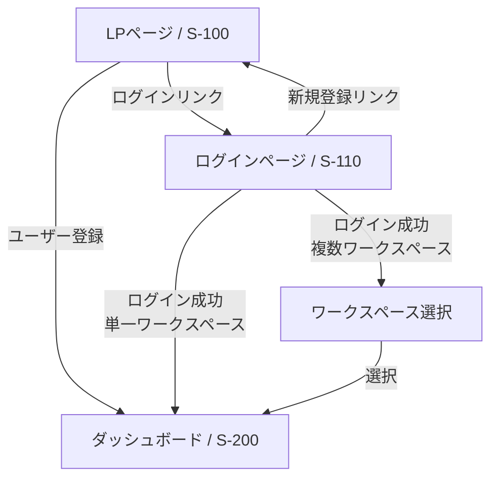

# FL-001: 認証フロー

## 概要

ユーザーの新規登録とログインに関する画面遷移フロー。

## フロー図

## ステップ詳細

### 1. LP ページからの新規登録

- **開始画面**: LP ページ（S-100）
- **アクション**: ユーザー登録フォームに入力して登録
- **処理**:
  - ユーザーアカウント作成
  - デフォルトワークスペースを自動作成（名前: "マイワークスペース"）
  - ユーザーをオーナーとして登録
- **遷移先**: ダッシュボード（S-200）
- **備考**: 作成されたデフォルトワークスペースが自動的に選択される

### 2. LP ページからログインページへ

- **開始画面**: LP ページ（S-100）
- **アクション**: 「ログインはこちら」リンクをクリック
- **遷移先**: ログインページ（S-110）

### 3. ログインページからログイン（単一ワークスペース）

- **開始画面**: ログインページ（S-110）
- **アクション**: ログインフォームに入力してログイン
- **条件**: ユーザーが1つのワークスペースのみに所属
- **処理**: そのワークスペースを自動選択
- **遷移先**: ダッシュボード（S-200）

### 4. ログインページからログイン（複数ワークスペース）

- **開始画面**: ログインページ（S-110）
- **アクション**: ログインフォームに入力してログイン
- **条件**: ユーザーが複数のワークスペースに所属
- **遷移先**: ワークスペース選択画面
- **処理**:
  - 所属ワークスペース一覧を表示
  - ユーザーが使用するワークスペースを選択
  - 選択後、ダッシュボード（S-200）へ遷移

### 5. ログインページから LP ページへ

- **開始画面**: ログインページ（S-110）
- **アクション**: 「新規登録はこちら」リンクをクリック
- **遷移先**: LP ページ（S-100）

## ワークスペース関連の補足

- ダッシュボード上部には現在選択中のワークスペース名が表示される
- ユーザーはダッシュボードからワークスペースを切り替え可能
- すべてのデータ操作は選択中のワークスペースに対して実行される
