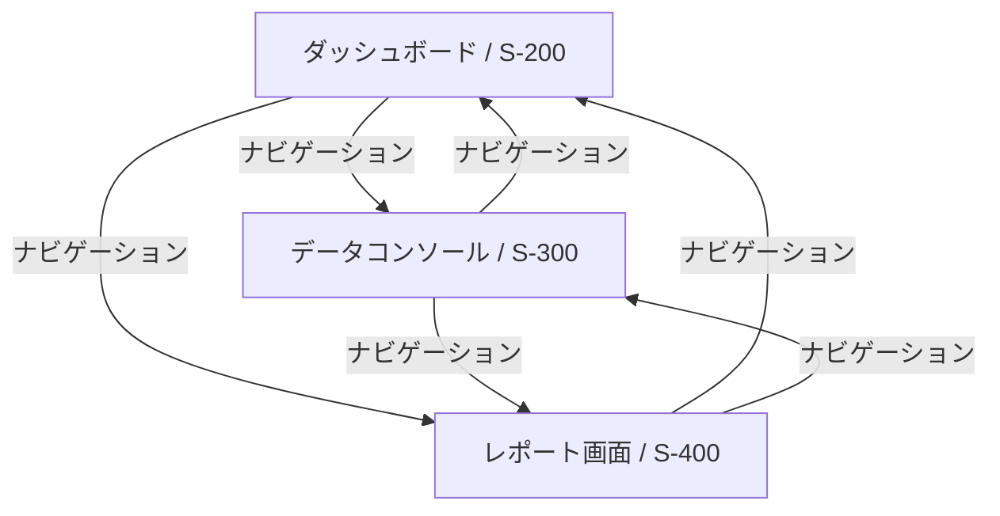

# FL-002: メインナビゲーションフロー

## 概要

ログイン後のメイン画面間のナビゲーションフロー。

## フロー図

## ステップ詳細

### ダッシュボードからの遷移

- **開始画面**: ダッシュボード（S-200）
- **遷移可能先**:
  - データコンソール（S-300）
  - レポート画面（S-400）

### データコンソールからの遷移

- **開始画面**: データコンソール（S-300）
- **遷移可能先**:
  - ダッシュボード（S-200）
  - レポート画面（S-400）

### レポート画面からの遷移

- **開始画面**: レポート画面（S-400）
- **遷移可能先**:
  - ダッシュボード（S-200）
  - データコンソール（S-300）

## 備考

- すべての認証後画面にはナビゲーションメニューが表示される
- 各画面から他の主要画面へ直接遷移可能
