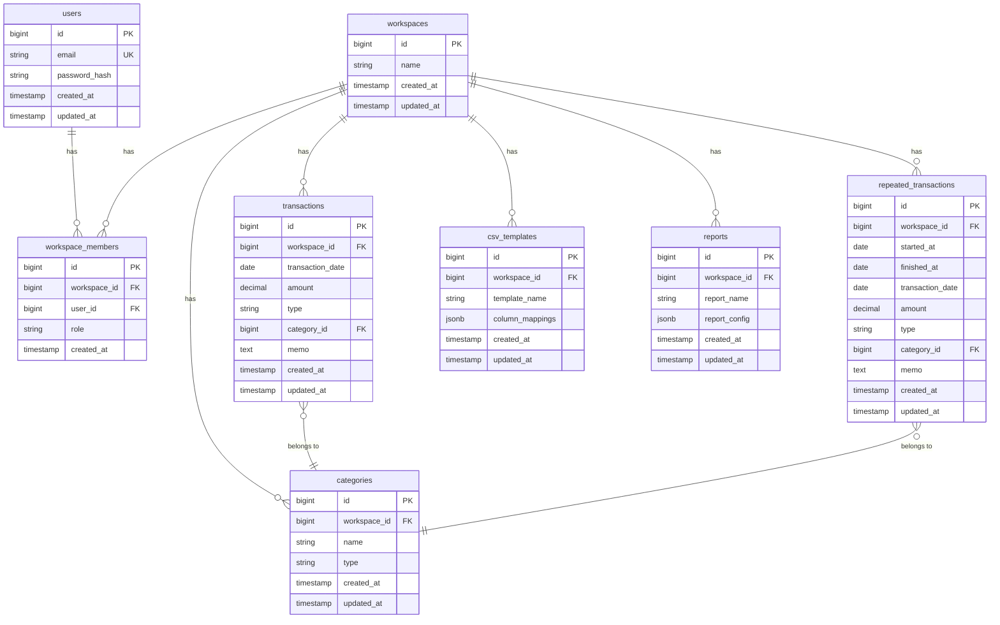

# ER 図

## データベース構成概要

FinSight のデータベースは PostgreSQL を使用し、以下のエンティティで構成される。

## ER 図

## 主要エンティティ

- **User（ユーザー）**: システム利用者
- **Workspace（ワークスペース）**: 家計簿データを管理する単位
- **WorkspaceMember（ワークスペースメンバー）**: ユーザーとワークスペースの所属関係
- **Transaction（収支データ）**: 個別の収入・支出記録
- **Category（カテゴリ）**: 収支の分類
- **RepeatedTransaction（繰り返しトランザクション）**: 定期的に発生する収支データ
- **CSVTemplate（CSV テンプレート）**: CSV マッピング設定
- **Report（レポート設定）**: 保存されたレポート設定

## エンティティ関連

### ユーザーとワークスペースの関係

- User は複数の WorkspaceMember を持つ（1:N）
- Workspace は複数の WorkspaceMember を持つ（1:N）
- User と Workspace は WorkspaceMember を介して多対多の関係（N:N）
- 1人のユーザーは複数のワークスペースに所属できる
- 1つのワークスペースには複数のユーザーが所属できる

### ワークスペースとデータの関係

- Workspace は複数の Transaction を持つ（1:N）
- Workspace は複数の Category を持つ（1:N）
- Workspace は複数の RepeatedTransaction を持つ（1:N）
- Workspace は複数の CSVTemplate を持つ（1:N）
- Workspace は複数の Report を持つ（1:N）

### データ間の関係

- Transaction は 1 つの Category を参照する（N:1、任意）
- RepeatedTransaction は 1 つの Category を参照する（N:1、任意）
